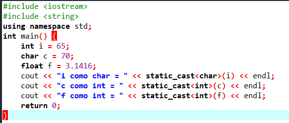
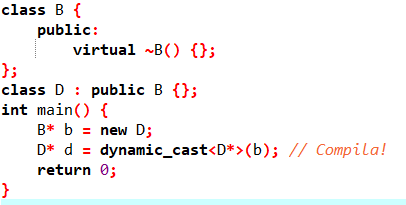
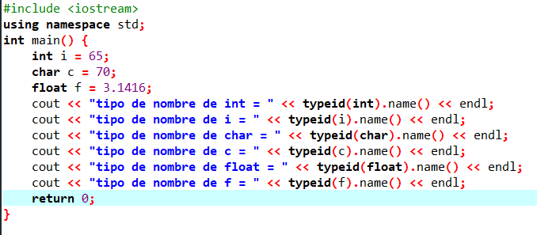

# C++ PDC_06

## :copyright: Autor
- :camera: 
- 
 :man: **Kevin Josue Rodriguez Henandez**
- :e-mail: Kevin31344@unitec.edu
- :link: [github.com/kevin09102001](https://github.com/kevin09102001)

---

## :black_circle: static_cast<type>(variable)

---
## :triangular_ruler: salida

---
## :black_circle: static_cast vs dynamic_cast 1/3

---
## :triangular_ruler: salida

---

## :black_circle: static_cast vs dynamic_cast 2/3

---
## :triangular_ruler: salida

---
## :black_circle: static_cast vs dynamic_cast 3/3

---
## :triangular_ruler: salida

---
## :black_circle: code de funciones 

---
## :triangular_ruler: salida

---
## :black_circle: typeid

---
## :triangular_ruler: salida

---
## :black_circle: sobrecarga_operadores 1

---
## :triangular_ruler: salida

---
## :black_circle: sobrecarga_operadores 2

---
## :triangular_ruler: salida

---
## :black_circle: Asignacion_Tiempo

---
## :triangular_ruler: salida

---

## :computer: Repositorio

- :blue_book: [Link directo del repositorio](https://github.com/kevin09102001/PDC_09_Kevin-Josue-Rodriguez_12011123)
